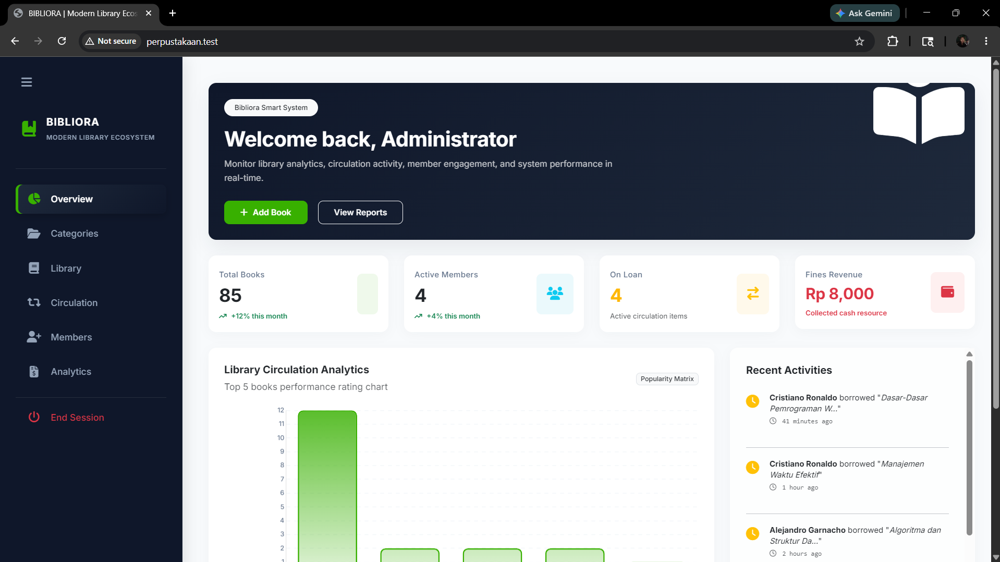
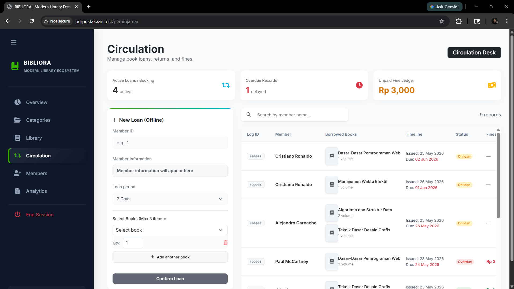
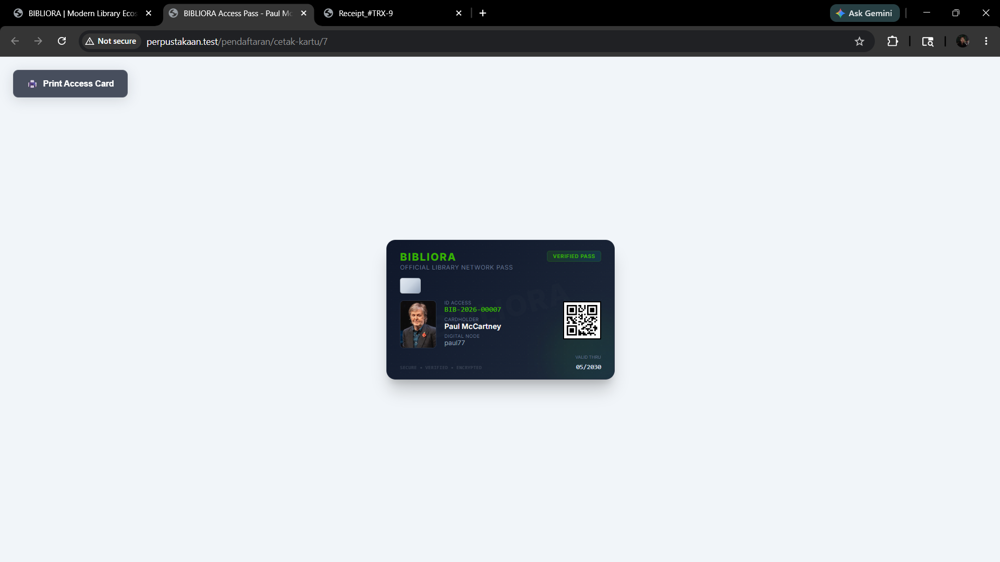
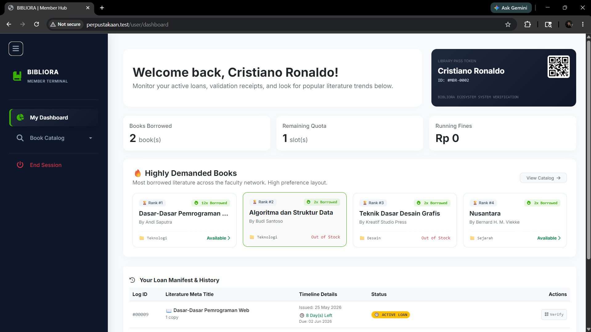

# Bibliora - Library Ecosystem

Bibliora adalah sistem manajemen perpustakaan yang dibangun untuk mengotomatisasi pendataan buku, sirkulasi peminjaman, hingga sistem denda secara akurat. Sistem ini dirancang untuk memastikan operasional perpustakaan berjalan transparan dan efisien, baik bagi admin maupun anggota.

##  Preview

**Dashboard Admin**

**Dashboard Anggota**

##  Alur Kerja

1. **Sirkulasi:** Peminjaman dapat dilakukan via _booking_ mandiri oleh anggota (menunggu persetujuan admin) atau transaksi langsung di tempat oleh admin.
2. **Proses:** Sistem mencatat masa pinjam secara otomatis saat buku diserahkan.
3. **Pengembalian:** Pengembalian buku dan penyelesaian denda (jika ada keterlambatan) dilakukan melalui dasbor admin.

##  Fungsi Utama

- **Sistem Keamanan Proaktif:** Pengecekan status _blacklist_ anggota secara _real-time_ saat admin melakukan transaksi (mencegah anggota bermasalah melakukan pinjaman).
- **Verifikasi Publik:** Fitur validasi struk peminjaman via QR-Code yang dapat diakses publik tanpa login, menjamin transparansi data transaksi.
- **Otomatisasi Sirkulasi:** Mendukung dua skenario: _booking_ mandiri atau transaksi _walk-in_ oleh admin.
- **Perpanjangan Mandiri:** Anggota dapat memperpanjang masa pinjam buku sendiri (batas 1x per transaksi) untuk efisiensi admin.
- **Manajemen Denda:** Perhitungan denda otomatis berbasis durasi keterlambatan.
- **Antarmuka Interaktif:** Pembaruan data anggota (seperti foto profil) via AJAX untuk alur kerja cepat tanpa harus _page reload_.
- **Quota Management:** Pengaturan batasan jumlah buku (3 buku) guna menjaga ketersediaan inventaris.

## 🛠 Teknologi

- **Framework:** Laravel 10
- **Database:** MySQL
- **Frontend:** Bootstrap 5, SweetAlert2
- **Logic:** Carbon (Date-time math & business logic)

## ⚙️ Cara Menjalankan

1. `git clone https://github.com/mufaa7/Bibliora-Modern-Library-Ecosystem-laravel.git`
2. `cp .env.example .env`
3. `composer install`
4. `php artisan migrate`
5. `php artisan serve`

## 📄 Lisensi

MIT License.

---

### 📬 Kontak

Jika ada pertanyaan atau ingin berdiskusi lebih lanjut:

- **Email:** [mufarhan022@gmail.com](mailto:mufarhan022@gmail.com)
- **LinkedIn:** [Muhammad Farhan Fadholi](https://www.linkedin.com/in/muhammad-farhan-fadholi-4167b627a)
- **Instagram:** [@mufaa.f](https://www.instagram.com/mufaa.f)

---

_Developed by Muhammad Farhan Fadholi_
